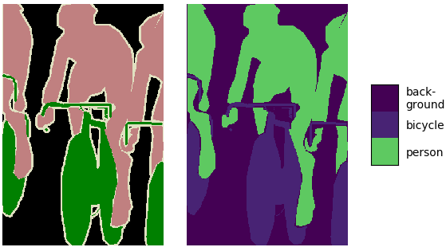
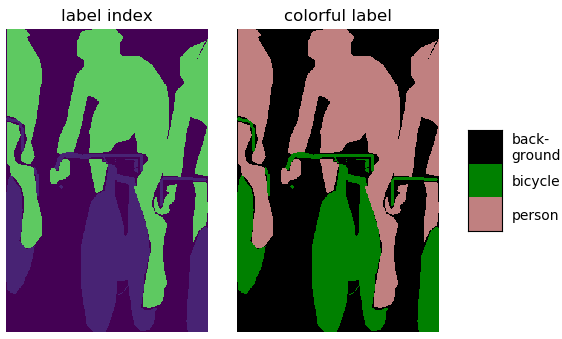

# Semantic Segmentation (Keras) 
___
Keras implementation of semantic segmentation FCNs

**Update Logs**
> **2019-02-22**:  implemented several common FCNs and support Geo-tiff Images (especially for remote sensing images).
>
> **2019-03-07**:  tested on VOC2012 dataset (multi-class, rgb inputs) and Inria dataset (binary class, rgb inputs).
>

**TODO**
> - [ ] More SOTA FCN architectures.
> - [ ] Support different output strides in backbones.
> - [ ] Support different open data sets like VOC, CityScapes, ADE20K, MSCOCO, etc.
> - [ ] More flexible in data format.


**Backbones(Encoders) that have been implemented**
> - [x] ResNet_v2 (including ResNet_v2-50, ResNet_v2-101, ResNet_v2-150, ResNet_v2-200)
> - [x] ResNet_v2_separable (including ResNet_v2-50, ResNet_v2-101, ResNet_v2-150, ResNet_v2-200)
> - [x] VGG (inclufing VGG-16, VGG-19)
> - [x] Xception-41

**Backbones to be implemented**
> - [ ] DenseNet


**FCNs that have been implemented**
> - [x] [FCN][FCN_paper] (including FCN-8s, FCN-16s, FCN-32s)
> - [x] [SegNet][SegNet_paper]
> - [x] [U-Net][UNet_paper], Res U-Net, Mobile U-Net
> - [x] [PSPNet][PSPNet_paper]
> - [x] [RefineNet][RefineNet_paper]
> - [x] [Deeplab v3][Deeplab_v3_paper]
> - [x] [Deeplab v3+][Deeplab_v3p_paper]
> - [x] [Dense ASPP][DenseASPP_paper]

**FCNs to be implemented**
> - [ ] ICNet
> - [ ] etc


---
### Folder Structures
```
.  
├── core  
│   ├── __init__.py 
|   |
│   ├── configures.py
|   | 
│   ├── encoder   
│   |   ├── __init__.py  
│   |   ├── resnet_v2.py  
│   |   ├── resnet_v2_separable.py  
│   |   ├── vggs.py  
│   |   └── xceptions.py  
│   |  
│   ├── nets  
│   |   ├── __init__.py  
│   |   ├── deeplabs.py  
│   |   ├── dense_aspp.py  
│   |   ├── fcns.py  
│   |   ├── pspnets.py  
│   |   ├── refinenets.py  
│   |   ├── segnets.py  
│   |   └── unets.py  
│   |  
│   └── utils  
│       ├── __init__.py  
│       |
│       ├── data_utils  
│       |   ├── __init__.py  
│       |   ├── image_io_utils.py  
│       |   ├── label_transform_utils.py  
│       |   ├── image_augmentation_utils.py  
|       |   ├── directory_iterator.py  
│       |   └── data_generator.py  
│       |  
│       ├── loss_utils.py  
│       ├── metric_utils.py  
│       ├── model_utils.py  
│       ├── net_utils.py  
│       ├── training_utils.py  
│       ├── predicting_utils.py  
│       └── vis_utils.py  
│     
├── data  
│   
├── examples  
│   ├── __init__.py  
│   ├── s1_generate_datasets.py  
│   ├── s2_training.py 
|   ├── directory_iterator.py 
│   └── s3_predicting.py  
│     
├── tools
|   ├── color2index.py
|   ├── generate_dataset.py
│   └── helpers.py
|
├── LICENSE  
|  
└── README.md  　　
```


---
### Running environment
The source code was compiled in a Windows 10 platform using Python 3.6.
The dependencies include:
> `tensorflow-gpu`: 1.9, backend  
> `Keras`: 2.2.4, framework  
> `opencv`: 4.0, used for image I/O  
> `PIL`: used for image I/O  
> `numpy`: used for array operations  
> `matplotlib`: used to visualize images  
> `tqdm`: used to log iterations  
> `GDAL`: used for geo-spatial image I/O  
> `scikit-learn`: used for metric evaluation  

---
### Usage
#### 1. Generate data sets
- Since we can randomly crop patch images from the input images, we do not need to prepare training images.
- However, for large images like HSR remote sensing image tiles, cropping patch images when training is extraordinarily time-consuming. 
- Thus for such datasets, we can crop them into a certain size and resize the input images to target size for convenience. 
- More can be found in `./tools/generate_dataset.py`
#### 2. Convert colorful label to label index
- More can be found in `./tools/color2index.py`

The following figure shows converting colors to labels:


The following figure shows converting labels to colors:

#### 3. Training models

dataset are organized as the following folder structure:
```
voc
  ├── image                         # input image
  ├── label_color                   # colorful label
  ├── label_index                   # gray indexed label
  ├── prediction                    # prediction
  ├── _temp                         # temp dir
  ├── models                        # model instance
  ├── logs                          # training logs
  ├── train.txt                     # training file names
  └── val.txt                       # validation file names
```
#### 3. Applying Predicting 
#### 4. Evaluation 

#### 5. Additional 
##### Dataset
- WHU Building Dataset [[Data]][WHU_data]  [[Paper]][WHU_paper]
- Inria Aerial Building Labeling Dataset [[Data]][Inria_data]   [[Paper]][Inria_paper]
- ISPRS 2D Semantic Labeling Benchmark [[Main]][ISPRS_semantic_labeling]
- Massachusetts Roads and Buildings Dataset [[Data]][Mass_data]
- VOC2012 [[Main]][VOC_main]   [[Data]][VOC]
- VOC2012 Augmentation [[Data]][VOC_aug]
- CityScapes Dataset [[Data]][CityScapes]
- ADE20K Dataset [[Data]][ADE20K]

---
### Contact
Penghua Liu (liuph3@mail2.sysu.edu.cn), Sun Yat-sen University


[Deeplab_v3_paper]: https://arxiv.org/abs/1706.05587
[Deeplab_v3p_paper]: https://arxiv.org/abs/1802.02611
[FCN_paper]: https://arxiv.org/abs/1411.4038
[SegNet_paper]: https://arxiv.org/abs/1511.00561
[DenseASPP_paper]: http://openaccess.thecvf.com/content_cvpr_2018/html/Yang_DenseASPP_for_Semantic_CVPR_2018_paper.html
[RefineNet_paper]: https://arxiv.org/abs/1611.06612
[PSPNet_paper]: https://arxiv.org/abs/1612.01105
[UNet_paper]: https://arxiv.org/abs/1505.04597

[WHU_data]: http://study.rsgis.whu.edu.cn/pages/download/
[WHU_paper]: https://ieeexplore.ieee.org/abstract/document/8444434
[Inria_data]: https://project.inria.fr/aerialimagelabeling/
[Inria_paper]: https://hal.inria.fr/hal-01468452/document
[ISPRS_semantic_labeling]: http://www2.isprs.org/commissions/comm3/wg4/2d-sem-label-potsdam.html
[Mass_data]: https://www.cs.toronto.edu/~vmnih/data/

[VOC_main]: http://host.robots.ox.ac.uk/pascal/VOC/voc2012/index.html
[VOC]: http://host.robots.ox.ac.uk/pascal/VOC/voc2012/VOCtrainval_11-May-2012.tar
[VOC_aug]: http://www.eecs.berkeley.edu/Research/Projects/CS/vision/grouping/semantic_contours/benchmark.tgz
[CityScapes]: https://www.cityscapes-dataset.com/
[ADE20K]: http://data.csail.mit.edu/places/ADEchallenge/ADEChallengeData2016.zip