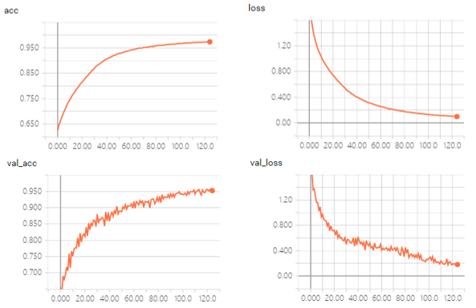
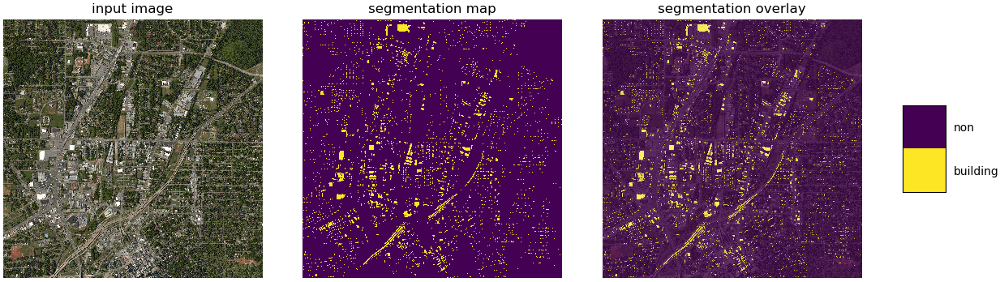
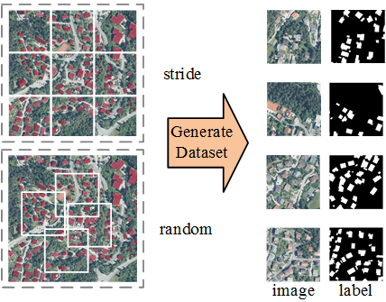

# Semantic Segmentation (Keras)

## 1. 代码简介

> 这个主仓是关于全卷积神经网络图像语义分割的实现，采用Keras框架。
>
> 持续更新版：https://github.com/liuph0119/Semantic_Segmentation_Keras
>
> 任何疑问请联系：刘鹏华 ([liuph3@mail2.sysu.edu.cn](mailto:liuph3@mail2.sysu.edu.cn)), 中山大学
>
> 主页：https://liuph0119.github.io

**更新日志**

> **2019-02-22**：实现了多个常用的FCN模型，支持Geo-Tiff格式图像。
>
> **2019-03-07**：在VOC 2012数据集（多类，RGB输入）和Inria数据集（2类，RGB输入）上测试通过。
>
> **2019-04-24**：优化细节，增加中文文档。

**TODO**

>-  引入更多SOTA FCN模型。
>-  Backbones 支持不同分辨率的输出（目前仅支持1/16）。
>- 支持更多的损失函数和评估指标。
>-  支持的数据格式更灵活，目前仅支持单波段/RGB/多波段/npy格式的输入，数据扩增仅支持前两种。

**已经实现的Backbones（Encoders）**

> -  ResNet_v2 (包括ResNet_v2-50, ResNet_v2-101, ResNet_v2-150, ResNet_v2-200)
> -  ResNet_v2_separable (包括ResNet_v2-50, ResNet_v2-101, ResNet_v2-150, ResNet_v2-200)
> -  VGG (包括VGG-16, VGG-19)
> -  Xception-41

**计划加入的Backbones（Encoders）**

> -  DenseNet

**已经实现的FCN模型**

> -  [FCN](https://arxiv.org/abs/1411.4038) (including FCN-8s, FCN-16s, FCN-32s)
> -  [SegNet](https://arxiv.org/abs/1511.00561)
> -  [U-Net](https://arxiv.org/abs/1505.04597), Res U-Net, Mobile U-Net
> -  [PSPNet](https://arxiv.org/abs/1612.01105)
> -  [RefineNet](https://arxiv.org/abs/1611.06612)
> -  [Deeplab v3](https://arxiv.org/abs/1706.05587)
> -  [Deeplab v3+](https://arxiv.org/abs/1802.02611)
> -  [Dense ASPP](http://openaccess.thecvf.com/content_cvpr_2018/html/Yang_DenseASPP_for_Semantic_CVPR_2018_paper.html)

**计划加入的FCN模型**

> -  ICNet
> -  等等

## 2. 运行环境

源代码在Windows 10 平台，Python 3.6编译通过，主要的依赖库包括：

> - `tensorflow-gpu`: 1.9, 底层
> - `Keras`: 2.2.4, 框架
> - `opencv`: 4.0, 图像IO
> - `PIL`: 图像IO
> - `numpy`: 数值运算
> - `matplotlib`: 可视化
> - `tqdm`: 迭代日志
> - `GDAL`: 空间影像IO
> - `scikit-learn`: 指标评估

## 3. 代码使用

### 1. 模型训练/预测/评估

#### 1. 模型训练

- 使用方式

> `python ./examples/training.py` 或者取消`run.cmd`中的对应注释行，运行`run.cmd`。

- `TrainingConfig` 类中的参数

>- `dataset_name`：数据集名称，用于Debug模式下对应数据集的配色实现可视化渲染。
>- `model_name`： 模型名称，用于构建模型。目前实现的模型有："fcn_8s"， "fcn_16s"， "fcn_32s"，  "segnet"， "unet"， "resunet"， "mobile_unet"， "pspnet"， "refinenet"， "deeplab_v3"，  "deeplab_v3p"。
>- `loss_name` ：损失函数名称，可选参数 "categorical_crossentropy"和 "binary_crossentropy"。
>- `metric_name`：精度评估指标，可选"acc"。
>- `encoder_name`：Encoder模型名称，可选参数："resnet_v1_50"， "resnet_v2_50"， "resnet_v2_101"， "resnet_v2_152"，"resnet_v2_200"， "resnet_v2_50_separable"， "resnet_v2_101_separable"， "resnet_v2_152_separable"， "resnet_v2_200_separable"， "xception_41"，"vgg_16"，"vgg_19"等。
>- `encoder_weights` ：Encoder预训练路径，默认为None。
>- `old_model_version`：旧模型的名称，用于中断之后继续训练时加载的旧模型。当然，如果不存在旧模型，则可随意设置。例如"deeplab_v3p_voc"。
>- `new_model_version` ：新模型的名称，用于保存新模型。同`old_model_version`。
>- `workspace` ：根路径，用于指定模型权重、Tensorboard保存日志等的路径。
>
>
>
>- `image_dir`：存放输入图像的文件夹。
>
>- `label`label_dir`：存放标签图像的文件夹。
>- `train_fnames_path`：存放训练图像文件名的文件`train.txt`的路径。
>- `val_fnames_path`：存放验证图像文件名的文件`train.txt`的路径。
>- `image_suffix`：输入图像的文件后缀。可选参数：".npy"，".jpg"，".jpeg"，".png"，".tif"。
>- `label_suffix`：标签图像的文件后缀。可选参数同`image_suffix`。
>- `image_color_mode`：输入图像的颜色模式，可选参数："gray"，"rgb"，"multi"。
>- `cval`：数据扩增时填充输入图像的值。
>- `label_cval`：数据扩增时填充标签图像的值。
>- `feed_onehot_label`：是否将标签进行onehot编码，bool型。
>- `crop_mode`：裁剪模式，可选参数："random"，"center"，"resize"，"none"。
>
>
>
>- `image_width`：网络输入图像的宽度。
>- `image_height`：网络输入图像的高度。
>- `image_channel`：网络输入图像的波段数目。
>- `n_class`：标签类别，至少为2。
>- `base_lr`：初始学习率。
>- `min_lr`：最小学习率，只有当`lr_mode`为`cosine_cycle`才有效。
>- `lr_mode`：学习率策略模式，可选参数："power_decay"， "exp_decay"， "progressive_drops"， "cosine_cycle" 和 "none"。
>- `lr_cycle`：当`lr_mode`为`cosine_cycle`时的余弦周期。
>- `lr_power`：当`lr_mode`为`power_decay`或`exp_decay`时的衰减指数。
>- `optimizer_name`：优化器名称，出于优化器参数的灵活性，目前可选参数为"adam"，"rmsprop"和"sgd"。
>- `batch_size`：批次大小。
>- `epoch`：训练回合数。
>- `steps_per_epoch`：每个回合的训练次数，取值为0时表明全部样本都会用于训练。
>- `steps_per_epoch_val`：每个回合的验证次数，取值为0时表明全部样本都会用于验证。
>- `verbose`：verbose参数，取值为0， 1， 2。
>- `early_stop_patience`：验证集的损失函数经过n次仍未提升则提早停止训练，该参数定义n的大小。取值为0时不会提前停止。
>- `debug`：是否边训练边查看训练的图像，bool型。
>- `model_summary`：是否输出网络结构，bool型。

可通过TensorBoard查看训练日志，并将训练结果导出为csv或json。

训练日志曲线

#### 2. 模型预测

- 使用方式

> `python ./examples/predicting.py` 或者取消`run.cmd`中的对应注释行，运行`run.cmd`。

- `PredictingConfig`类中的参数

>- `model_name`：模型名称。
>- `encoder_name`：encoder名称。
>- `model_path`：模型的路径。
>- `image_dir`：存放输入图像的路径。
>- `preds_dir`：存放预测图像的路径。
>- `dataset_name` ：数据集名称，用于可视化时颜色渲染。
>- `image_height`：模型输入图像高度。
>- `image_width`：模型输入图像宽度。
>- `mode`：预测模式，可选参数"stride"和"per_image"。采用"stride"时在输入图像上移动取块预测概率，最后取概率均值再求max，适用于遥感影像等大景影像；采用"per_image"时将输入图像缩放为模型输入大小直接预测。
>- `stride`：采用"stride"模式时的移动步长，建议为输入图像的1/4。
>- `to_prob`：是否保存为概率（而不是标签），bool型。
>- `geo`：是否在预测结果中注入空间投影信息，bool型。
>- `plot`：是否边预测边可视化显示，bool型。

分割结果图

#### 3. 模型评估

- 使用方式

> `python ./examples/evaluating.py` 或者取消`run.cmd`中的对应注释行，运行`run.cmd`。

- `EvaluatingConfig`类中的参数

> - `preds_dir`：预测结果存放路径。
> - `label_dir`：标签图像存放路径。
> - `dataset_name`：数据集名称。
> - `mode`：模式，可选参数："global"和"per_image"。采用"global"参数时会统计全局的混淆矩阵，最后再计算各评估指标，而采用"per_image"通过计算每一张图像的精度，最后取平均值。
> - `ignore_0`：是否不考虑0（背景类），bool型。

### 2. 工具集
#### 1. 裁剪训练样本
对于**遥感影像等大景影像**，将其首先裁剪为小的图像块，便于后续模型训练时加快速度。主要依赖`tools/generate_dataset.py`程序。

- 使用方式

> 在`core/configures.py`中修改`GenerateDataSetConfig`类的参数，运行`python ./tools/generate_dataset.py`或取消`run.cmd`中的对应注释，运行`run.cmd`。

- `GenerateDataSetConfig` 类中的参数
> - `image_dir`: 存放影像的路径。
> - `label_dir`: 存放标签的路径。
> - `image_suffix`: 图像的后缀。
> - `label_suffix`: 标签的后缀。
> - `dst_dir`： 保存路径。
> - `method`: 包括`random`和`stride`两种模式。`random`是在每张影像上随机裁剪 n 张（这 n 张可能有重叠）；`stride`是从影像的左上角至右下角移动扫描取块，需要指定移动步长 s。
> - `image_height`: 图像块的高度（行数）。
> - `image_width`: 图像块的宽度（列数）。
> - `image_number_per_tile`: 每张影像随机选取的图像块数目，即`method`介绍中的 n。
> - `stride`: 移动扫描取块时的步长，即`method`介绍中的 s。
> - `label_is_gray`: 标签是否为单波段，bool 型。
> - `use_gdal`: 是否采用 gdal 读取图像，一般读取Geotiff格式的遥感影像需要使用gdal， bool型。

#### 2. label转换

由于FCN训练要求样本的标签值为0~n (positive类别数为n，含背景)，而大部分标签数据为了可视化一般会用不同的颜色标识，导致标签的颜色并非其类别。
因此，我们首先需要将颜色转为类别。注意的是，我们固定住0为背景类别，而1~n为positive类别数。即使你的样本标签中没有背景，我们也会为背景预留class=0。
因此，如果你强制要求你的输出不能有其他类（例如背景），你可以考虑在最后预测比较softmax的概率输出时不考虑背景类的概率。

我们实现了将颜色转为类别（主要用于训练），以及将类别转回颜色（主要用于可视化）两种模式。因此首先需要做的就是在`core/configures.py`的`COLOR_MAP`和`NAME_MAP`添加数据集名称，设置每一类的颜色和名称，记住不要动背景类的位置。

 
color2index 结果对比

index2color 结果对比

- 使用方式
> 修改`Color2IndexConfig`类中的参数，运行`python color2index.py`或取消`run.cmd`中的对应注释，运行`run.cmd`。

- `Color2IndexConfig` 类中的参数
> - `dataset_name`： 数据集名称，与`COLOR_MAP`和`NAME_MAP`中的对应。
> - `src_dir`: 原始label的路径。
> - `dst_dir`: 保存新label的路径。
> - `color_mode`：label的颜色模式，包括 `gray`和`rgb`两种模式。
> - `mode`: 转换模式，包括`color2index`和`index2color`。
> - `show_comparison`: 是否边转换边显示对比结果，bool型。

#### 3. 其他

我们也提供了一些其他的工具，例如 `convert_vocmat_to_png`，`create_train_val_txt`，`find_all_files`等，具体可参考`tools/helpers.py`中的实现。

## 4. 其他资料

##### Dataset

- WHU Building Dataset [[Data\]](http://study.rsgis.whu.edu.cn/pages/download/) [[Paper\]](https://ieeexplore.ieee.org/abstract/document/8444434)
- Inria Aerial Building Labeling Dataset [[Data\]](https://project.inria.fr/aerialimagelabeling/) [[Paper\]](https://hal.inria.fr/hal-01468452/document)
- ISPRS 2D Semantic Labeling Benchmark [[Main\]](http://www2.isprs.org/commissions/comm3/wg4/2d-sem-label-potsdam.html)
- Massachusetts Roads and Buildings Dataset [[Data\]](https://www.cs.toronto.edu/~vmnih/data/)
- VOC2012 [[Main\]](http://host.robots.ox.ac.uk/pascal/VOC/voc2012/index.html) [[Data\]](http://host.robots.ox.ac.uk/pascal/VOC/voc2012/VOCtrainval_11-May-2012.tar)
- VOC2012 Augmentation [[Data\]](http://www.eecs.berkeley.edu/Research/Projects/CS/vision/grouping/semantic_contours/benchmark.tgz)
- CityScapes Dataset [[Data\]](https://www.cityscapes-dataset.com/)
- ADE20K Dataset [[Data\]](http://data.csail.mit.edu/places/ADEchallenge/ADEChallengeData2016.zip)